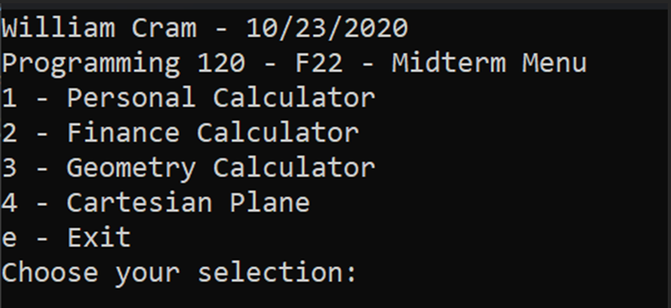
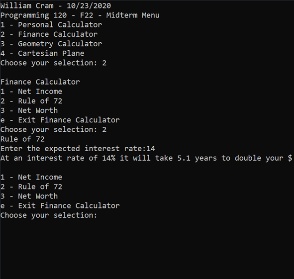
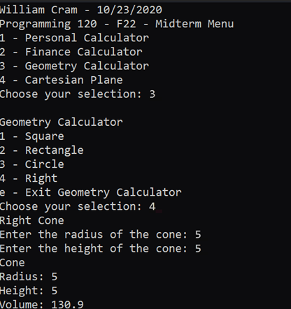
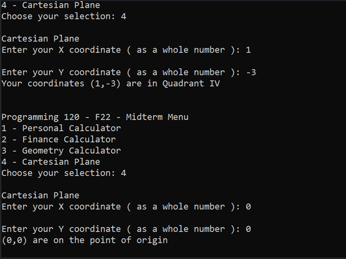
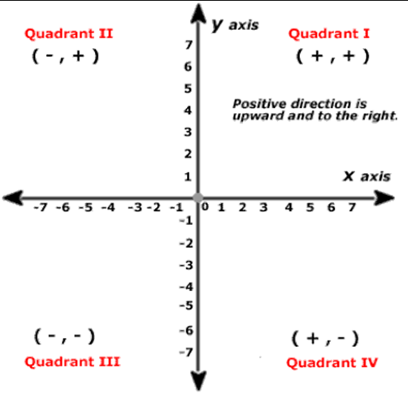

# Programming 120 - Midterm

## Objective

This assignment for Programming 120 is all about getting hands-on with coding by creating a cool console app that lets you play around with different calculators—like for basic math, personal finance, and geometry—and even figuring out where points land on a Cartesian plane.

It's a mix of making menus with if-else statements, catching errors so the app doesn't crash when things go awry, and turning user inputs into calculations and results that make sense. Plus, it's a chance to show off how you can keep your code clean and understandable with helpful comments.

And if you're up for an extra challenge, there's a bonus task that dives deeper into the Cartesian plane stuff. It's a practical way to use what you've learned in class, from programming logic to math, all while building something functional and fun.

---

## Calculator Menu:

1. **Basic Calculator**
    - Take a number, then let you add, subtract, multiply, or divide that number by another, then display the result.

2. **Finance Calculator**
    - 3 Equations:
        - **Net Income**: Ask for the user's income and costs, display their net income.
        - **Rule of 72**: Ask the user for the rate of interest, display how many years it’ll take to double their money.
        - **Net Worth**: Ask for the assets and liabilities, display their net worth.

3. **Geometry Calculator**
    - 4 Options:
        - **Square**: Ask for a side, display the area and perimeter.
        - **Rectangle**: Ask for the length and width, display the area and perimeter.
        - **Circle**: Ask for the radius, display the area and circumference.
        - **Right Circular Cone**: Ask for the radius and height, display the volume.

4. **Cartesian Plane**
    - Ask the user for a pair of x and y coordinates. Based on the result, print what quadrant the coordinates fall in, or if they are on the point or on an axis.

---

# Assignment

---

### Main Menu
- You have been provided the menu to interact with the user
- Replace the top comments with your name and the date
- The beggining of the Calcultor has been provided to help guide you though the rest of the assignment.

---

## Calculator Menu and use example

Ask the user for a number. Afterwards, ask the user what math operation they would like to perform. Then ask for a second number. Perform the math and display the result.

### The initial part of calculator has been provided as has the solution for addition. Fill in the rest.

### Math Operations:

1. **Addition**
2. **Subtraction**
3. **Multiplication**
4. **Division**

#### Steps:

1. Ask the user for a number.
2. Ask the user for a math operation to perform.
3. Ask the user for a second number.
4. Perform the chosen math operation.
5. Display the result.

You can use one big `try` / `catch` block around your code to handle any input errors gracefully.

---

## A Personal Finance Calculator

Equations can be found on this [website](https://sweatyourassets.biz/the-most-important-formulas-in-personal-finance/):

- **Net Income** (number 1) – Display your number with currency formatting
- **Rule 72** (number 4) – Display your number rounded to 2 digits
- **Net Worth** (number 6) – Display your number with currency formatting

For currency formatting use `.ToString(“c”)`
For rounding use `Math.Round(number, dec);` Ex. `Math.Round(123.3456,1)` returns `123.3`

You can use one big `try` / `catch` around your finance menu. Make sure it lets the user try another finance option if they don’t choose the right choice.

--- 

### A Geometry Calculator

You will give the user 4 options: 

- **Square**: Ask for a side, display the area and perimeter.
- **Rectangle**: Ask for the length and width, display the area and perimeter.
- **Circle**: Ask for the radius, display the area and circumference.
- **Right Circular Cone**: Ask for the radius and height, display the volume.

Equations can be found below for each option:

1. **Square**: Area = \( side^2 \) ([Equation](https://www.mathopenref.com/area.html))
2. **Rectangle**: Area = \( length \times width \) ([Equation](https://www.mathopenref.com/rectanglearea.html))
3. **Circle**: Area = \( \pi \times radius^2 \) ([Equation](https://www.mathopenref.com/circlearea.html))
4. **Volume of a Right Circular Cone**: Volume = \( \frac{1}{3} \pi r^2 h \) ([Equation](https://www.mathopenref.com/conevolume.html))

You can use one big `try` / `catch` around your menu. Make sure it lets the user try another option if they don't choose the right one.

--- 

## Cartesian Plane
Certainly! Here's the information reformatted with Markdown:

Ask the user for a pair of x and y coordinates. Based on the result, print what quadrant the coordinates fall in, or if they are on the point or on an axis.

Requires:
Logical Operators

You can use one big `try` / `catch` block around your code to handle any input errors gracefully.

--- 

## Rubric

| Category                              | Points | Description                                                                                      |
|---------------------------------------|--------|--------------------------------------------------------------------------------------------------|
| **Functionality**                     | **100**|                                                                                                  |
| Basic Calculator                      | 25     | Correctly performs addition, subtraction, multiplication, and division operations               |
|                                      | 15     | Handles user input errors gracefully using try/catch block                                        |
|                                      | 10     | Displays the result in a clear and understandable format                                          |
| Finance Calculator                    | 30     | Implements all three equations: Net Income, Rule of 72, Net Worth                                 |
|                                      | 15     | Calculates and displays results with correct formatting                                           |
|                                      | 10     | Provides options to try another finance equation if the user chooses the wrong one                |
| Geometry Calculator                  | 25     | Implements all four options: Square, Rectangle, Circle, Right Circular Cone                       |
|                                      | 15     | Calculates and displays results with correct formatting                                           |
|                                      | 10     | Handles user input errors gracefully using try/catch block                                        |
| Cartesian Plane                      | 20     | Correctly identifies the quadrant or axis on which the given coordinates lie                      |
|                                      | 10     | Handles user input errors gracefully using try/catch block                                        |
|                                      | 10     | Provides clear and understandable output                                                        |
| **Code Quality and Organization**     | **80** |                                                                                                  |
| Clean and Understandable Code        | 30     | Code is well-commented and easy to understand                                                    |
|                                      | 10     | Variable names are descriptive and meaningful                                                    |
| Modularization                       | 30     | Code is logically divided into functions for different functionalities                           |
|                                      | 15     | Each calculator option has its own function or class                                             |
| Error Handling                       | 15     | Implements robust error handling using try/catch blocks                                           |
|                                      | 10     | Handles invalid user inputs gracefully                                                           |
| **User Interface**                    | **60** |                                                                                                  |
| Main Menu Display                    | 20     | Main menu is displayed clearly and attractively                                                   |
|                                      | 10     | Menu options are numbered and easy to navigate                                                    |
| Calculator Interfaces                | 30     | Each calculator menu is presented clearly with relevant instructions                              |
|                                      | 15     | User input prompts are clear and intuitive                                                        |
| Output Presentation                  | 15     | Results are displayed neatly and formatted correctly                                              |
| **Bonus Task (Extra 20 points)**     | **20** |                                                                                                  |
| Cartesian Plane Extension           | 20     | Implements the bonus task of diving deeper into the Cartesian plane functionality                  |
| **Total Points**                      | **300**|                                                                                                  |

